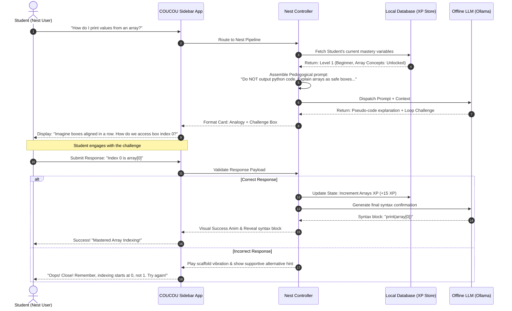
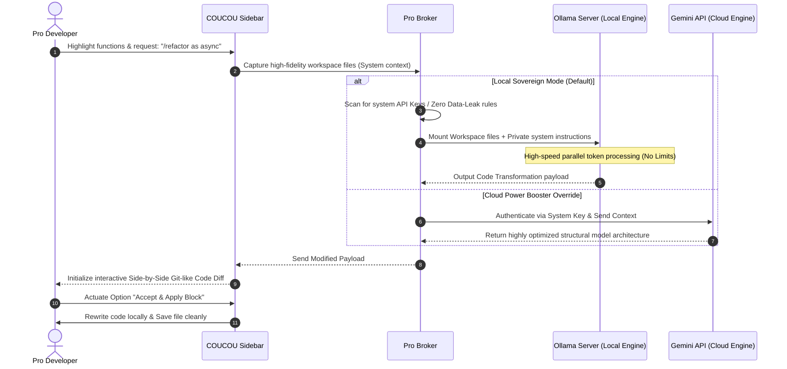

# COUCOU AI: Unified Modeling Language (UML) & System Flowcharts

This document defines the complete architectural design and process models for **COUCOU AI**. It provides detailed UML Sequence, Activity, and State Machine diagrams for both **COUCOU Nest (Learner Sandbox)** and **COUCOU Pro (Professional Agent)** environments.

---

## 1. High-Level Architectural Layout
COUCOU operates as a hybrid Local-First system. The diagram below illustrates how client interactions are conditionally routed based on the active mode (**NEst** vs. **Pro**).

```mermaid
graph TD
    User([Developer / Student]) -->|Interacts with Front-end| IDE[VS Code / Antigravity Sidebar UX]
    
    subgraph Client-Side Boundary (Your Device)
        IDE -->|Check Session Mode| Router{Mode Router}
        
        %% COUCOU Nest Path
        Router -->|Nest Mode Active| NestController[Nest Socratic Broker]
        NestController -->|Get User XP & Level| LocalDB[(Local SQLite / Browser State)]
        NestController -->|Load Curated Educational System Prompts| SystemPrompt[Pedagogical Prompt Engine]
        NestController -->|Send Socratic Instructions| LocalLLM[Local Offline LLM - Ollama / LM Studio]
        
        %% COUCOU Pro Path
        Router -->|Pro Mode Active| ProController[Pro Gateway Broker]
        ProController -->|Codebase Index Context| ContextEngine[RAG Context Parser]
        ProController -->|Private Offline Target| LocalLLM
    end
    
    subgraph Cloud Gateway (Secure Sandbox)
        ProController -->|Direct Hybrid Cloud Switch| CloudAPI[Google Gemini 1.5 Pro/Flash Gateway]
    end
    
    LocalDB -.->|Saves Progression / Sandbox History| IDE
    LocalLLM -->|Generate Socratic Hint / Code| IDE
    CloudAPI -->|Generate High-Performance Output| IDE
```

---

## 2. COUCOU Nest (Socratic Tutoring Flow)
Unlike normal AI assistants that perform "Copy-Paste Generation," **COUCOU Nest** is a Socratic supervisor. It refuses to write direct solutions unless the user progresses through active conceptual scaffolding.

### A. Activity State Diagram (The Socratic Loop)
This workflow represents the interactive loop designed to prevent passive copy-pasting.

```mermaid
stateDiagram-v2
    [*] --> Idle
    Idle --> UserInputReceived : Student enters coding puzzle/question
    
    state Nest_Prompter {
        UserInputReceived --> AnalyzeKnowledgeState : Check XP Level & Concept Map
        AnalyzeKnowledgeState --> InjectPrompterPersona : Add Pedagogical System Rules
        InjectPrompterPersona --> InstructOllama : Select TinyLlama / Phi-3 Local LLM
    }
    
    InstructOllama --> GenerateSocraticScaffolding : Local Model Formulation
    
    state User_Engagement {
        GenerateSocraticScaffolding --> PresentHintAndPseudoCode : Show Analogy & Pseudo-code
        PresentHintAndPseudoCode --> PresentVerificationChallenge : Prompt with Multiple Choice / Fill-in-Gap
        PresentVerificationChallenge --> AwaitStudentResponse : Standby
    }
    
    AwaitStudentResponse --> EvaluateResponse : Student submits answer
    
    state Answer_Evaluation {
        EvaluateResponse --> IsCorrect{Is Response Valid?}
        IsCorrect --> Yes : Correct Match!
        IsCorrect --> No : Incorrect Attempt
    }
    
    Yes --> UnlockCodeSnippet : Present exact code blocks
    UnlockCodeSnippet --> IncrementXP : Add XP to Segment Concept Map (e.g., Arrays)
    IncrementXP --> Idle
    
    No --> ProvideConstructiveFeedback : Deliver sub-hint/analogy adjustment
    ProvideConstructiveFeedback --> AwaitStudentResponse
```

### B. Sequence Diagram (Nest Lifecyle)
This Sequence diagram traces the lifecyle of a student seeking to solve a functional bug.



---

## 3. COUCOU Pro (Senior Developer Flow)
**COUCOU Pro** prioritizes speed, unbounded token availability, and zero data leakage. It connects directly to local high-parameter models and falls back seamlessly to Gemini APIs for cloud calculations on request.

### A. Activity State Diagram (The Agentic Workflow)
This architecture guides code transformation requests recursively.

```mermaid
stateDiagram-v2
    [*] --> ListenToIDE
    ListenToIDE --> FileContextCaptured : Developer highlights code / Requests solution
    
    state Gatekeeper {
        FileContextCaptured --> AnalyzeSovereigntyRules : Check Workspace Settings
        AnalyzeSovereigntyRules --> RouteDecision{Is Data Cloud-Safe?}
        
        RouteDecision --> LocalOnly : YES (Configured for local sovereignty)
        RouteDecision --> CloudAllowed : NO (Developer initiates Gemini cloud bypass)
    }

    state Local_Execution {
        LocalOnly --> LoadLocalModel : Load DeepSeek-Coder / Mistral locally
        LoadLocalModel --> RunOfflineInference : Process query using local CPU/GPU
    }

    state Cloud_Execution {
        CloudAllowed --> EncryptPayload : Mask sensitive configurations
        EncryptPayload --> GoogleGeminiGateway : Send query to Gemini API (Pro/Flash)
    }

    RunOfflineInference --> MergeContextStream
    GoogleGeminiGateway --> MergeContextStream
    
    state Application {
        MergeContextStream --> PresentDiffViewer : Display Proposed Modifications inline
        PresentDiffViewer --> AwaitAcceptAction : User evaluates Side-by-Side Diff
        AwaitAcceptAction --> UserAccepted : User clicks "Accept / Apply"
        AwaitAcceptAction --> UserRejected : User cancels or modifies prompt
    }

    UserAccepted --> WriteDirectToFile : Edit standard file streams
    UserRejected --> CodeCycleComplete

    WriteDirectToFile --> CodeCycleComplete
    CodeCycleComplete --> ListenToIDE
```

### B. Sequence Diagram (Pro Context Pipeline)
How COUCOU Pro processes a massive file modification command securely.



---

## 4. System Progression State Comparison

| Feature Capability | COUCOU Nest (The Socratic Tutor) | COUCOU Pro (The Speed Agent) |
| :--- | :--- | :--- |
| **System Rules Directive** | Explanatory, comparative, gamified learning. | Actionable, high-efficiency, concise. |
| **Code-Writing Access** | Locked behind logical milestones & puzzles. | Fully unlocked, live multi-file editing enabled. |
| **Model Recommendations** | Optimized small models (Phi-3, TinyLlama 3B). | Large code-specialized models (DeepSeek 7B+). |
| **Data Footprint** | 100% Client-Side SQLite state tracking. | Strict Zero-Data Leak configuration default. |
| **Primary Value Engine** | Socratic learning & pedagogical growth. | Pure speed, token savings, and work-flow focus. |

---
*Created for the COUCOU AI Technical Architecture & Implementation Portfolio.*
